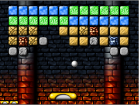

# Arkanoid

Questo è un tutorial particolare, perché non contiene la descrizione di come sviluppare tutto il gioco: difatti è destinato a "utenti" un po' più esperti.
Nel tutorial viene descritta la parte più complicata, ovvero come si possono modificare e aggiungere i livelli del gioco e come si fa a creare dei blocchi personalizzati.

[Scarica lo ZIP con tutti i file del tutorial](https://github.com/kronwiz/codingtutorials/raw/master/scratch/arkanoid/arkanoid.zip).

[Guarda l'anteprima sul sito di Scratch](https://scratch.mit.edu/projects/88495350/){:target="_blank"}.