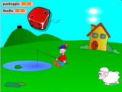

# Caduta dadi

Il gioco consiste nel premere il tasto corrispondente al numero che compare sulla faccia del dado che sta cadendo prima che questo tocchi terra. Se si preme il tasto giusto il punteggio aumenta di uno.

[Scarica lo ZIP con tutti i file del tutorial](https://github.com/kronwiz/codingtutorials/raw/master/scratch/caduta_dadi/caduta_dadi.zip).

[Guarda l'anteprima sul sito di Scratch](https://scratch.mit.edu/projects/58624412/){:target="_blank"}.