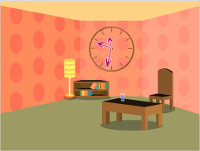

# Orologio analogico

Lo scopo è quello di realizzare un orologio analogico a video. Per lo sviluppatore si tratta di capire come convertire le misure di tempo in misure di angoli.

[Scarica lo ZIP con tutti i file del tutorial](https://github.com/kronwiz/codingtutorials/raw/master/scratch/orologio_analogico/orologio_analogico.zip).

[Guarda l'anteprima sul sito di Scratch](https://scratch.mit.edu/projects/238642233/).
