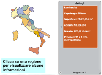

# Regioni italiane

Si tratta di creare una cartina geografica dell'Italia suddivisa per regioni. Cliccando su ciascuna regione si visualizzano alcune informazioni come il capoluogo, la superficie, ecc. Il tutorial può essere realizzato a vari livelli di complessità a seconda dell'età degli studenti, per esempio utilizzando la grafica già inclusa, oppure facendo realizzare a loro le immagini delle regioni o arricchendo a piacimento la parte che illustra i dettagli di ogni regione.

[Scarica lo ZIP con tutti i file del tutorial](https://github.com/kronwiz/codingtutorials/raw/master/scratch/regioni_italiane/regioni_italiane.zip).

[Guarda l'anteprima sul sito di Scratch](https://scratch.mit.edu/projects/237549863/).
