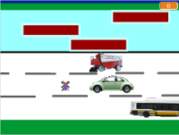

# Scarafaggio

Il povero scarafaggio deve superare una serie di pericoli per poter tornare a casa. Con i tasti frecce si possono controllare i suoi movimenti.

[Scarica lo ZIP con tutti i file del tutorial](https://github.com/kronwiz/codingtutorials/raw/master/scratch/scarafaggio/scarafaggio.zip).
