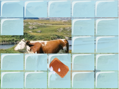

# Scopri immagini

L'obiettivo del gioco è quello di passare una spugna sopra le "piastrelle" che nascondono un'immagine per scoprire di che immagine si tratta.
Si può anche estendere il gioco facendo in modo, una volta scoperta completamente un'immagine, di passare a un'immagine successiva, e così via fino a quando si vuole.

[Scarica lo ZIP con tutti i file del tutorial](https://github.com/kronwiz/codingtutorials/raw/master/scratch/scopri_immagini/scopri_immagini.zip).

[Guarda l'anteprima sul sito di Scratch](https://scratch.mit.edu/projects/49248044/).
