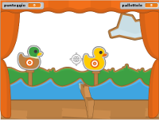

# Tiro a segno

Lo scopo del gioco è quello del tiro a segno che si trovava nei luna park nelle feste di paese: devi cercare di colpire i bersagli mobili con un fucile che muovi tramite il mouse.

[Scarica lo ZIP con tutti i file del tutorial](https://github.com/kronwiz/codingtutorials/raw/master/scratch/tiro_a_segno/tiro_a_segno.zip).

[Guarda l'anteprima sul sito di Scratch](https://scratch.mit.edu/projects/98004013/).
